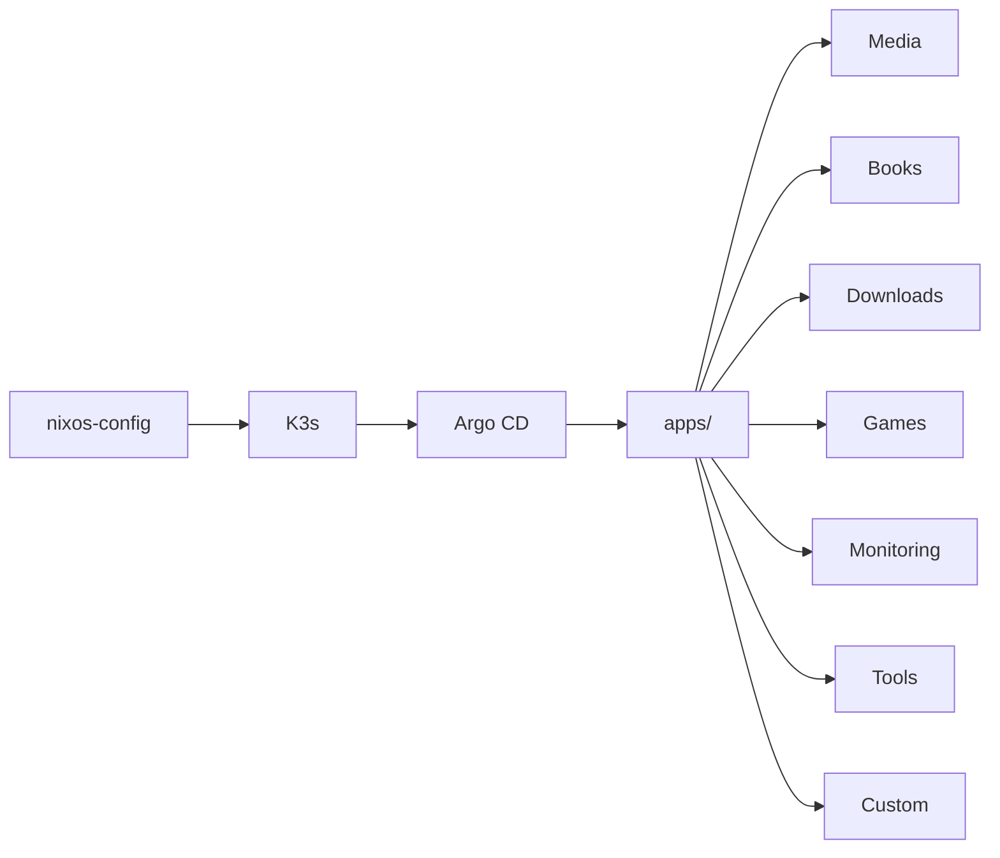
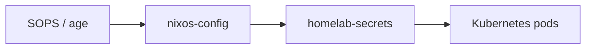

# homelab-k8s

Kubernetes manifests for my personal **K3s homelab**.

`nixos-config` handles the host, K3s, containerd, storage, SOPS and Argo CD bootstrap. This repository contains the actual **workloads** running inside the cluster.



## Workloads

| Group          | Services                                                      |
| :------------- | :------------------------------------------------------------ |
| **Media**      | Jellyfin, Navidrome, Seerr, Kiwix, Beets                      |
| **Books**      | Audiobookshelf, Bookshelf Audio/Ebooks, Kavita, Suwayomi      |
| **Arr**        | Sonarr, Radarr, Jackett                                       |
| **Downloads**  | qBittorrent, slskd, MeTube                                    |
| **Photos**     | Immich + PostgreSQL + Redis + ML                              |
| **Games**      | GameVault, Pelican Panel + Wings                              |
| **Monitoring** | OpenObserve, Vector, event-exporter, NFD, GPU exporters, ntfy |
| **Network**    | Tailscale proxy, SpoofDPI                                     |
| **Tools**      | File Browser, Memos, Syncthing                                |
| **Custom**     | Job Finder, `ur-music`                                        |

The repository currently contains manifests for these workload groups under `apps/`.

## Storage

Most applications use the host filesystem directly through `hostPath`.

```text
/home/cif/homelab/
├── config/
└── data/
    ├── media/
    ├── music/
    ├── photos/
    ├── torrents/
    ├── saves/
    └── ...
```

The directory layout is created by `nixos-config`; these manifests decide which workload gets access to which paths.

Most containers use UID `1000` / GID `100`, matching the host-side storage layout.

## Secrets

Credentials are kept outside the manifests and injected through the `homelab-secrets` Kubernetes Secret.



Public configuration stays in manifests/ConfigMaps; credentials are consumed through `secretKeyRef`.

## GitOps

Argo CD watches this repository and synchronizes `apps/`.

```text
nixos-config
      │
      └── K3s + Argo CD
                │
                ▼
          homelab-k8s
                │
                └── apps/
                    ├── arr/
                    ├── books/
                    ├── custom/
                    ├── databases/
                    ├── downloads/
                    ├── gamevault/
                    ├── immich/
                    ├── media/
                    ├── monitoring/
                    ├── network/
                    ├── pelican/
                    └── tools/
```

There is deliberately very little abstraction here: mostly plain Kubernetes YAML, grouped by purpose.

## Development

The repository includes a small `devenv` environment with:

* `kubectl`
* Helm
* `k9s`
* Flux CLI
* Kustomize
* local PostgreSQL
* YAML / Nix formatting hooks

The development environment is defined in `devenv.nix`.

## Notes

This is a **personal cluster configuration**, not a generic homelab template. Paths, permissions, storage layout and several workloads are tied to the host setup from `nixos-config`.

Some workloads are intentionally gated or disabled while they are being validated; for example, the current `ur-music` CronJobs are suspended and its deletion deployment is scaled to zero.

